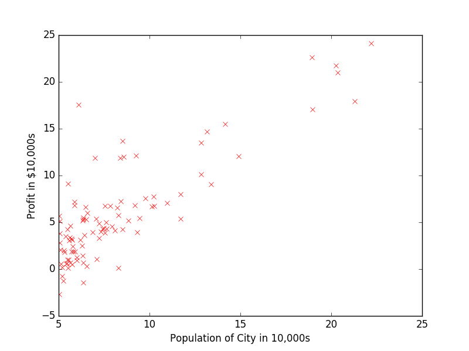
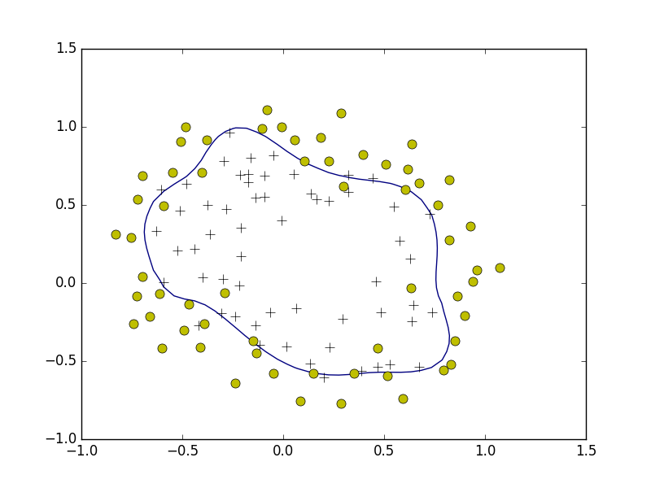
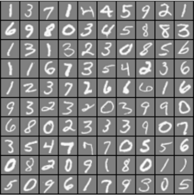
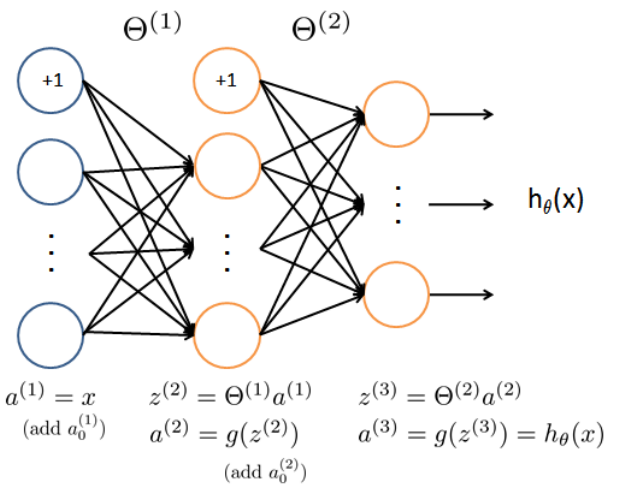

# Coursera Machine Learning in plain Python

This repository contains my solutions to the programming exercises of the [machine learning course] on Coursera written in plain Python. The exercise descriptions are stored in the respective subfolders.

 
 

Usage
-----

| Excer. | Usage | Dependencies | Topics |
|---|---|---|---|
| # 1  | Run `python3 ex1.py` | numpy, matplotlib, `ex1data1.txt`  | linear regression, gradient descent |
| # 2  | Run `python3 ex2.py` | numpy, matplotlib, scipy.optimize, `ex2data1.txt`  | logistic regression |
| # 3  | Run `python3 ex3.py` | numpy, matplotlib, `ex3data1_X.txt`, `ex3data1_y.txt` | neural networks |

About the author
----------------
I am a PhD student at TU Delft graduating in January 2018. My research focus is on numerical linear algebra, preconditioning, linear elasticity and model-order reduction. I also have a [website].

[machine learning course]: https://www.coursera.org/learn/machine-learning
[website]: http://www.manuelbaumann.de
