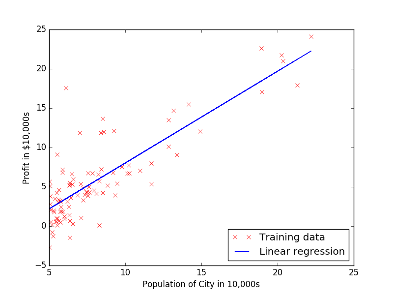

# Coursera Machine Learning in plain Python

This repository contains my solutions to the programming exercises of the [machine learning course] on Coursera written in plain Python.

About the author
----------------
I am a PhD student at TU Delft graduating in January 2018. My research focus is on numerical linear algebra, preconditioning, linear elasticity and model-order reduction. I also have a [website].

[machine learning course]: https://www.coursera.org/learn/machine-learning
[website]: http://www.manuelbaumann.de
